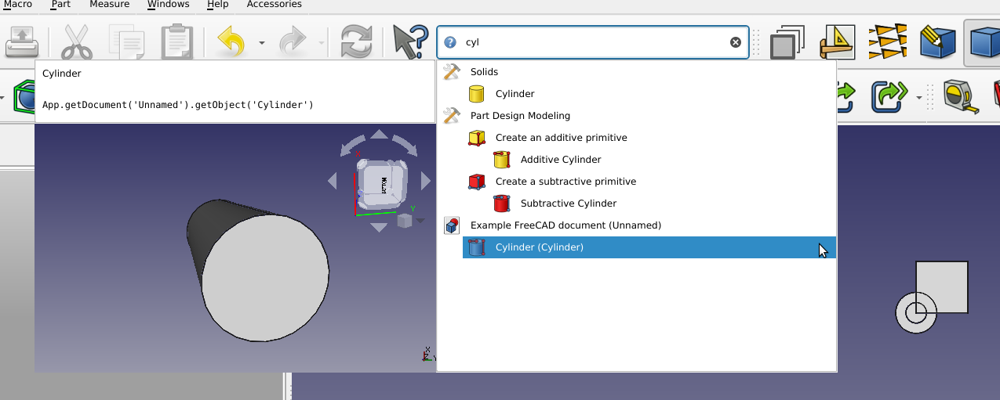
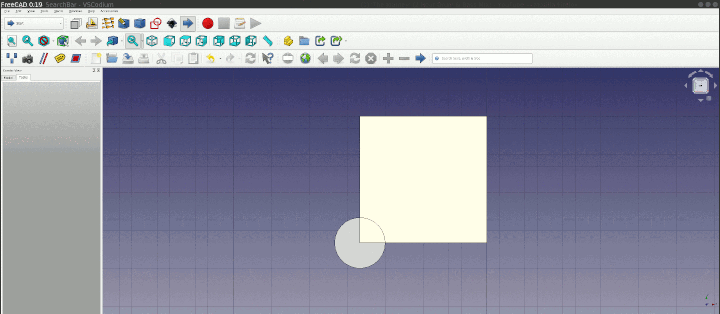

## FreeCAD SearchBar

This FreeCAD mod adds a search bar for tools, document objects and preferences.

## Dependencies

None.

### Usage

The search bar appears next to the [`What's this?`](https://wiki.freecad.org/Std_WhatsThis) tool  in FreeCAD's default File toolbar.

When using the search bar for the first time, it will contain only the tools of the workbenches which have already been loaded in FreeCAD.
To include results from other workbenches, select the first search result "Refresh list of tools" which will load all FreeCAD workbenches
and memorize their tools. After restarting FreeCAD, the search result will include the memorized tools, even if the workbenches have not
been loaded yet. When selecting a tool from the search results, SearchBar will attempt to automatically load the workbenches which could
have provided that tool.

To navigate the search results, use the up and down arrows. Typing characters will filter the results on the fly. The extended information
panel next to the search results provides further documentation about the results, e.g. Python snippets which can be copy-pasted (note:
currently a bug crashes FreeCAD if using the context menu to perform the copy, please do not use the context menu until
https://github.com/SuzanneSoy/SearchBar/issues/12 is fixed.

### License 

See [LICENSE](./LICENSE).
This repository is in the public domain.

## Maintainer

TODO

## Details

This workbench was originally created by [SuzzaneSoy](https://github.com/SuzanneSoy/SearchBar). All credit for this workbench goes to her.